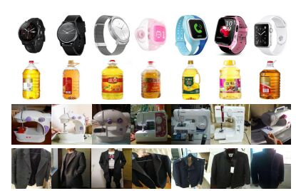

# :sparkles:SKU级别的商品图像数据集汇总

## 1. AiProducts-Challenge（阿里2020）
**下载地址**：[2020-AiProducts-Challenge-dataset](https://github.com/mingliangzhang2018/AiProducts-Challenge/tree/master/dataset)

**数据介绍**：Large-scale Product Recognition赛题与数据-天池大赛-阿里云天池

该数据集包含近 300 万张图片，涵盖 5 万个 SKU 级商品类别。商品图像的类别和总量均为业界之最。此数据集中涵盖了大量的生活用品、食物等，数据集中没有人工标注，数据较脏，数据分布较不均衡，且有很多相似的商品图片。

**数据样例**：  

  

  

1st-plan：[1st__Winner Solution for AliProducts Challenge Large-scale Product Recognition.pdf](https://trax-geometry.s3.amazonaws.com/cvpr_challenge/recognition_challenge_technical_reports/1st__Winner+Solution+for+AliProducts+Challenge+Large-scale+Product+Recognition.pdf)

6st-plan：[GitHub -AiProducts-Challenge](https://github.com/mingliangzhang2018/AiProducts-Challenge)

## 2. RPC：大规模零售产品结账数据集
**下载地址**：[Retail Product Checkout Dataset](https://www.kaggle.com/datasets/diyer22/retail-product-checkout-dataset)

**数据介绍**：[RPC-PDF](https://arxiv.org/pdf/1901.07249.pdf)

**数据样例**：  

  

  

## 3. Products-10K（京东）
**下载地址**：[Large scale product recognition challenge](https://products-10k.github.io/challenge.html#downloads)

**数据介绍**：[Products-10K](https://arxiv.org/pdf/2008.10545.pdf)

京东在线客户经常购买的10,000种产品，涵盖时尚、3C、食品等全品类，医疗保健，家居用品等。Products-10k 数据集中的所有图片均来自京东商城。数据集中共包含 1 万个经常购买的 SKU。所有 SKU 组织成一个层次结构。总共有近 19 万张图片。在实际应用场景中，图像量的分布是不均衡的。所有图像都由生产专家团队手工检查/标记。

**数据样例**:

  

  

1st-plan:冠军方案分享：[ICPR 2020大规模商品图像识别挑战赛冠军解读](https://blog.51cto.com/u_15298598/3121258)

## 4. [iMaterialist FGVC6 产品识别挑战赛(CVPR 2019码隆科技)](https://www.kaggle.com/c/imaterialist-product-2019/)
**数据介绍**：

该数据集共有 2,019 个产品类别，它们被组织成一个具有四个层次的层次结构。此类别树可以在product_tree.json中找到，并使用product_tree.pdf进行可视化。每个叶节点对应一个类别 id，类别共享同一个祖先属于同一个超类。树结构不参与评估，但可能在模型训练期间使用。

train.json包含id,class,url每个训练图像，您可以在其中使用和类标签url下载相应的图像。训练数据包含来自 2,019 个类别的 1,011,532 张图像（每个类别的范围从 158 到 1050 张图像）。
val.json包含id,class,url验证集中的图像。验证数据有 10,095 张图像（每个类别大约 5 张）。
test.json包含id,url测试集中的图像。测试数据有 90,834 张图像（每个类别大约 45 张）。
**数据下载**：比赛数据可在Google Drive或百度盘下载（密码：qecd）

1st-plan:[iMaterialist Challenge on Product Recognition](https://www.kaggle.com/c/imaterialist-product-2019/)

## 5. SmartUVM_Datasets（2019哈工大（深圳））
**数据介绍**：[SmartUVM_Datasets（全球新零售环境提供标准数据集）.pdf](https://dl2link.com/Selected%20Journal%20Publications/Towards%20New%20Retail%20A%20Benchmark%20Dataset%20for%20Smart%20Unmanned%20Vending%20Machines.pdf)

**数据样例**：

  

  

**数据下载**：[SmartUVM_Datasets_down(8G).tar](https://www.dl2link.com/dataset/SmartUVM_Datasets.tar)

## 6. Grocery Store Dataset（）
**数据介绍([paper.pdf](https://arxiv.org/pdf/1901.00711.pdf))**：  

该存储库包含杂货商品的自然图像数据集。所有自然图像都是用智能手机相机在不同的杂货店拍摄的。最终得到了来自 81 种不同类别的水果、蔬菜和纸箱物品（例如果汁、牛奶、酸奶）的 5125 张自然图像。81个类分为42个粗粒度类，例如细粒度类“Royal Gala”和“Granny Smith”属于同一个粗粒度类“Apple”。

**数据样例**：

  

  

**数据下载**：https://github.com/marcusklasson/GroceryStoreDataset

## 7. MVTEC D2S（ECCV2018）
**数据介绍([paper.pdf](https://openaccess.thecvf.com/content_ECCV_2018/papers/Patrick_Follmann_D2S_Densely_Segmented_ECCV_2018_paper.pdf))**：  

Densely Segmented Supermarket (D2S) 数据集是工业领域中实例感知语义分割的基准。它包含 21,000 张高分辨率图像，带有所有对象实例的像素标签。这些物品包括来自 60 个类别的杂货和日常用品。该基准的设计使其类似于自动结账、库存或仓库系统的真实设置。训练图像仅包含同质背景上的单个类别的对象，而验证集和测试集则更加复杂和多样化。为了进一步衡量实例分割方法的鲁棒性，使用不同的光照、旋转和背景获取场景。

**数据样例**：

  

**数据下载**：[MVTec Densely Segmented Supermarket Dataset (MVTec D2S)](https://www.mvtec.com/company/research/datasets/mvtec-d2s)

## 8. SHORT(WACV2014)
**数据介绍([paper.pdf](https://projet.liris.cnrs.fr/imagine/pub/proceedings/ICIP-2014/Papers/1569914435.pdf))**:   

该数据集由一组高质量的训练图像和一组近13.5万张智能手机拍摄的30种食品的测试图像组成。包括零食，化妆品，药品，饮料，罐头食品，乳制品.训练集是高质量的，从产品手册、广告、3D产品视图中收集。测试集的质量并不稳定，因为图像是从手持手机上采集的，视角不同，清晰度不同，背景杂波不同，遮挡不同，光照不同，镜面反射不同。

**数据样例**：

  

**数据下载**：待定

## 9. Locount(AAA2021)

**数据介绍（[paper.pdf](https://projet.liris.cnrs.fr/imagine/pub/proceedings/ICIP-2014/Papers/1569914435.pdf)）**:  

在 28 个不同的商店和公寓中收集了一个大规模的对象定位和计数数据集，该数据集由 50,394 张图像组成，JPEG 图像分辨率为 1920x1080 像素。注释了 140 个类别（包括Jacket、Shoes、Oven等）中的超过 190 万个对象实例。

为了方便数据的使用，我们将数据集划分为两个子集，即训练集和测试集，包括 34,022 幅训练图像和 16,372 幅测试图像。该数据集包括9大子类，即婴儿用品（例如，婴儿尿布和婴儿拖鞋）、饮料（例如，果汁和姜茶）、食品（例如，干鱼和蛋糕）、日化用品（例如，肥皂和洗发水） )、服装（如夹克和成人帽）、电器（如微波炉和插座）)、存储设备（例如，垃圾和凳子）、厨房用具（例如，叉子和食品盒）以及文具和体育用品（例如，滑板和笔记本）。

**数据样例**：

  

**数据下载**：[IntelligentTEAM / AAAI2021 Locount Dataset](https://isrc.iscas.ac.cn/gitlab/research/locount-dataset)

# :heart:特别感谢
1. 特别感谢[Funny AI](https://zhuanlan.zhihu.com/p/490105852)提供的相关材料，本文已征得作者授权；
2. 特别感谢[PaddleClas](https://github.com/PaddlePaddle/PaddleClas/blob/release/2.4/docs/zh_CN/data_preparation/recognition_dataset.md#2.2.2)提供部分材料。
